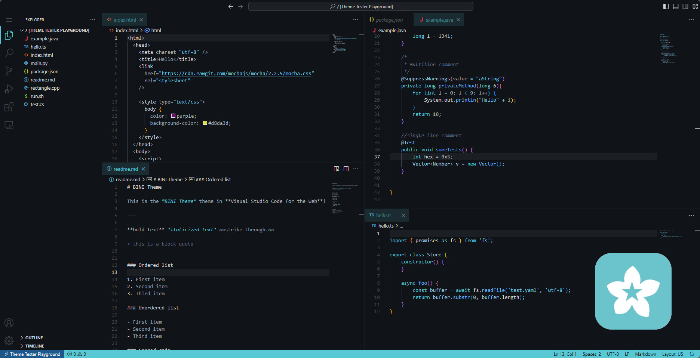

# BINI Theme 🌸  

   

     
    
    <h4>A Visual Studio Code theme for Bloom programmers and developers. 🌸🎨💻</h4>
    
    
    
     
     
    
Have suggestions in mind? <a href="https://github.com/warengonzaga/bini-theme/issues">Let me know!</a>

    
Like this project? Leave a star! ⭐⭐⭐⭐⭐

## 📥 Installation

1. Open Extensions sidebar panel in VS Code. **View** → **Extensions**
2. Search for **BINI Theme**
3. Click **Install** to install it
4. Click **Reload** to reload the editor
5. **Code** > **Preferences** > **Color Theme** > **BINI Theme**

## ❣️ Inspiration

I always wanted to create a theme for Visual Studio Code so I decided to create a theme that is inspired by the brand colors of a P-POP girl group in the Philippines called **[BINI](https://bini.global)**. I think this is a good opportunity to create a theme that is inspired by their brand colors and also support them in my own little way. 🌸

## 🌸 Color Themes

### 📦 BINI Theme (Default)

The colors I use is based on their official website. I compiled the colors and created a theme that is inspired by their brand colors.

| Syntax Color                                                                                                      | Usage                        |
| ----------------------------------------------------------------------------------------------------------------- | ---------------------------- |
|  | Foreground                   |
|  | Variables, Properties        |
|  | Keywords                     |
|  | Numbers                      |
|  | Classes, Constants           |
|  | Functions, Methods           |
|  | Strings                      |
|  | Operators, Special Functions |
|  | Comments                     |

### 🐶 BINI Theme (Aiah Theme)

The color I use for this variant is based on the color of **Aiah** combined with the color of BINI theme default color palette. I created this variant to support **Aiah** and also to create a new variant for the BINI theme. If your bias is Aiah, feel free to use this color theme variant.

| Syntax Color                                                                                                      | Usage    |
| ----------------------------------------------------------------------------------------------------------------- | -------- |
|  | Keywords |

### 🐺 BINI Theme (Colet Theme)

The color I use for this variant is based on the color of **Colet** combined with the color of BINI theme default color palette. I created this variant to support **Colet** and also to create a new variant for the BINI theme. If your bias is Colet, feel free to use this color theme variant.

| Syntax Color                                                                                                      | Usage    |
| ----------------------------------------------------------------------------------------------------------------- | -------- |
|  | Keywords |

### 🐨 BINI Theme (Gwen Theme)

The color I use for this variant is based on the color of **Gwen** combined with the color of BINI theme default color palette. I created this variant to support **Gwen** and also to create a new variant for the BINI theme. If your bias is Gwen, feel free to use this color theme variant.

| Syntax Color                                                                                                      | Usage    |
| ----------------------------------------------------------------------------------------------------------------- | -------- |
|  | Keywords |

## 🎯 Contributing

Contributions are welcome, create a pull request to this repo and I will review your code. Please consider to submit your pull request to the `dev` branch. Thank you!

Read the project's [contributing guide](./contributing.md) for more info.

## 🐛 Issues

Please report any issues and bugs by [creating a new issue here](https://github.com/warengonzaga/bini-theme/issues/new/choose), also make sure you're reporting an issue that doesn't exist. Any help to improve the project would be appreciated. Thanks! 🙏✨

## 🙏 Sponsor

Like this project? **Leave a star**! ⭐⭐⭐⭐⭐

Want to support my work and get some perks? [Become a sponsor](https://github.com/sponsors/warengonzaga)! 💖

Or, you just love what I do? [Buy me a coffee](https://buymeacoffee.com/warengonzaga)! ☕

Recognized my open-source contributions? [Nominate me](https://stars.github.com/nominate) as GitHub Star! 💫

## 📋 Code of Conduct

Read the project's [code of conduct](./code_of_conduct.md).

## 📃 License

This project is licensed under [The MIT License](https://opensource.org/licenses/MIT).

## 📝 Author

This project is created by **[Waren Gonzaga](https://github.com/warengonzaga)**, with the help of awesome [contributors](https://github.com/warengonzaga/bini-theme/graphs/contributors).

---

💻 with ❤️ by [Waren Gonzaga](https://warengonzaga.com) and [Him](https://www.youtube.com/watch?v=HHrxS4diLew&t=44s) 🙏
